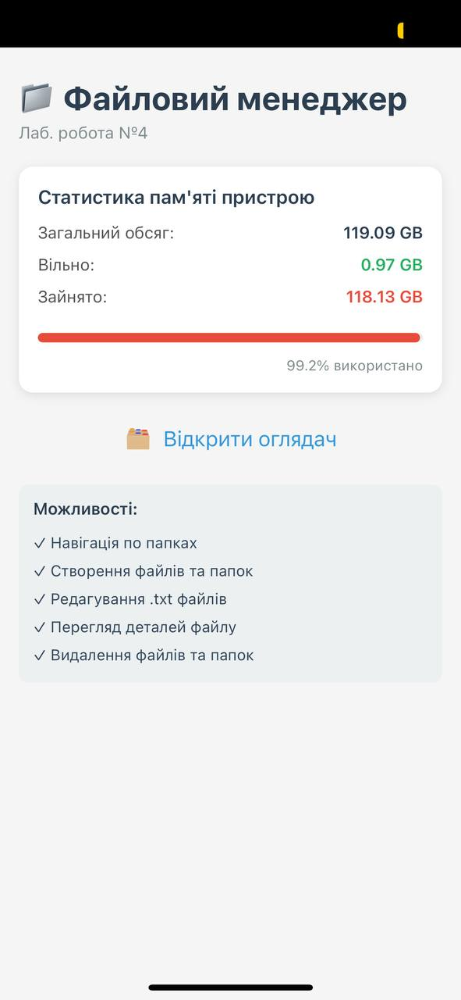
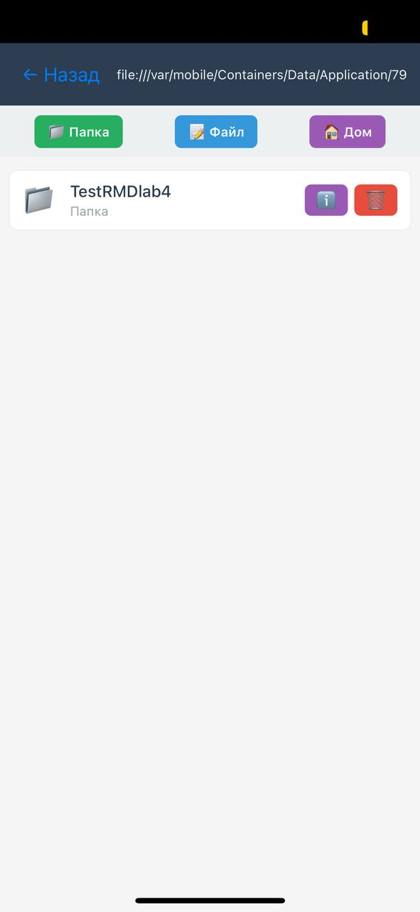
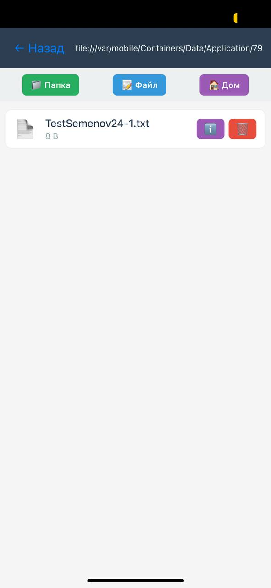
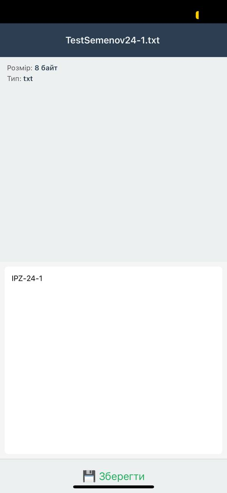
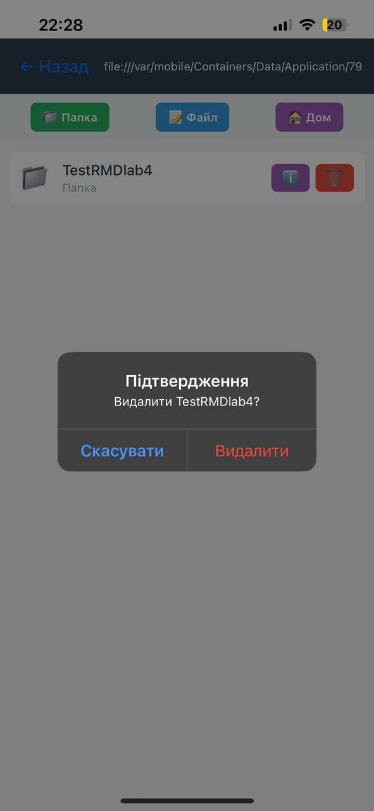
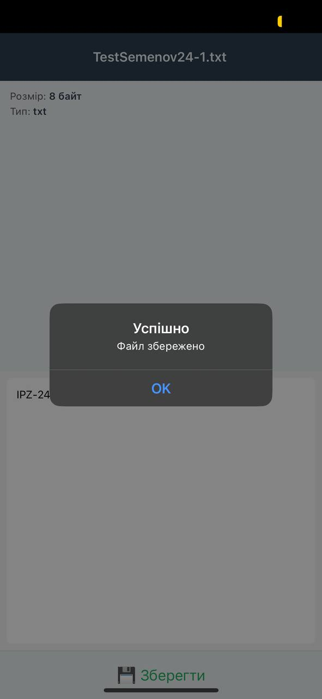

# Лабораторна робота 4 — Файловий менеджер

**Мета**: Опанувати механізми роботи з локальною файловою системою мобільного пристрою, використовуючи бібліотеку `expo-file-system`.

## Опис проєкту

Простий Expo-застосунок для роботи з локальною файловою системою пристрою. Дозволяє користувачу переглядати директорії, створювати, редагувати та видаляти файли та папки.

## Реалізовані функції

### 1. **Головний екран з статистикою пам'яті**
- Відображення загального обсягу пам'яті
- Відображення вільного простору
- Відображення займаного простору
- Візуальна шкала використання пам'яті
- Кнопка для переходу до оглядача файлів

### 2. **Навігація по файловій системі**
- Перегляд вмісту директорій (файли та папки)
- Перехід у вкладені папки
- Навігація назад до попередньої директорії
- Можливість повернутися на головний екран
- Відображення поточного шляху (breadcrumb)

### 3. **Створення папок та файлів**
- Створення нової папки з введеною користувачем назвою
- Створення нового текстового файлу (`.txt`) з іменем та початковим вмістом
- Модальні вікна для введення даних

### 4. **Перегляд та редагування текстових файлів**
- Відкриття файлів для перегляду вмісту
- Редагування тексту у файлі
- Збереження змін до файлу
- Відображення інформації про файл (розмір, тип)

### 5. **Видалення файлів та папок**
- Видалення обраного файлу або папки
- Виведення діалогу підтвердження перед видаленням
- Безпечне видалення з обробкою помилок

### 6. **Перегляд детальної інформації про файл**
- Назва файлу
- Тип файлу (розширення)
- Розмір файлу (у B, KB, MB, GB)
- Дата та час останньої модифікації
- Статус існування файлу
- Повний шлях до файлу

### 7. **Користувацький інтерфейс**
- Використання `FlatList` для відображення списку файлів
- Іконки для розрізнення файлів та папок
- Кольорова схема з вибірковими кнопками дій
- Модальні вікна для введення даних
- Індикатори навігації

## Вимоги до встановлення

- **Node.js** версія 20.19.4 або новіша
- **npm** або **yarn**
- **Expo CLI** (встановлюється через `npm`)
- Android емулятор або iOS симулятор (або Expo Go на реальному пристрої)

## Інструкція запуску

### 1. Встановлення залежностей

```bash
cd rmd_lab4
npm install
```

### 2. Запуск проєкту

```bash
npm start
# або
npx expo start
```

### 3. Відкриття на пристрої

Після запуску, ви побачите QR-код у терміналі. Виберіть одну з опцій:

- **Android**: Натисніть `a` у терміналі, щоб відкрити Android емулятор
- **iOS**: Натисніть `i` у терміналі, щоб відкрити iOS симулятор  
- **Реальний пристрій**: Відсканіруйте QR-код за допомогою **Expo Go** (доступна в App Store/Google Play)

Примітка: проєкт зараз зібраний на Expo SDK 54, щоб на iPhone працювати без помилки legacy manifest.

## Структура проєкту

```
rmd_lab4/
├── App.js                    # Головний компонент з маршрутизацією
├── package.json              # Залежності проєкту
├── README.md                 # Цей файл
├── src/
│   ├── screens/
│   │   ├── MainScreen.js     # Екран зі статистикою пам'яті
│   │   ├── ExplorerScreen.js # Оглядач файлів з навігацією
│   │   ├── FileEditorScreen.js # Редактор текстових файлів
│   │   └── FileDetailScreen.js # Екран з інформацією про файл
│   └── components/
│       └── FileItem.js       # Компонент для відображення файлу/папки
```

## Залежності

- **react-native**: `0.81.5`
- **expo**: `54.0.34`
- **expo-file-system**: `19.0.22`

## Як користуватися

1. **На головному екрані**: Перегляньте статистику пам'яті та натисніть кнопку "Відкрити оглядач"

2. **У оглядачі файлів**:
   - Натисніть на файл/папку, щоб відкрити
   - Натисніть на кнопку "ℹ️", щоб переглянути деталі
   - Натисніть на кнопку "🗑️", щоб видалити

3. **Для створення**:
   - Натисніть кнопку "📁 Папка" для створення нової папки
   - Натисніть кнопку "📝 Файл" для створення нового текстового файлу

4. **При редагуванні файлу**:
   - Змініть текст у полі редактору
   - Натисніть "💾 Зберегти" для збереження змін

## Технологічний стек

- **React Native**: Фреймворк для розробки мобільних додатків
- **Expo**: Платформа для розробки та публікації React Native додатків
- **expo-file-system**: Бібліотека для роботи з файловою системою пристрою
- **JavaScript (ES6+)**: Мова програмування

## Примітки

- Всі файли та папки створюються у каталозі `FileSystem.documentDirectory` (папка додатку)
- Додаток не має доступу до системних файлів — тільки до свого каталогу
- На емуляторі можна тестувати всі функції
- На реальному пристрої потрібно надати доступ до файлової системи (обробляється автоматично Expo)

## Скріншоти















